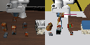
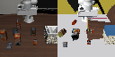
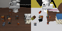
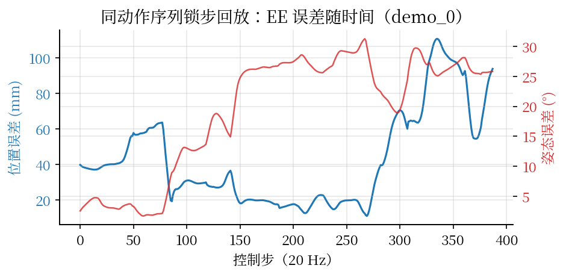
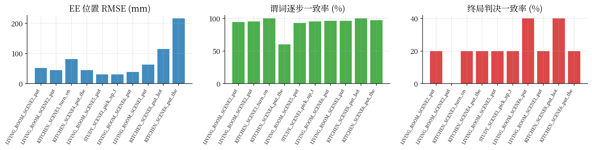
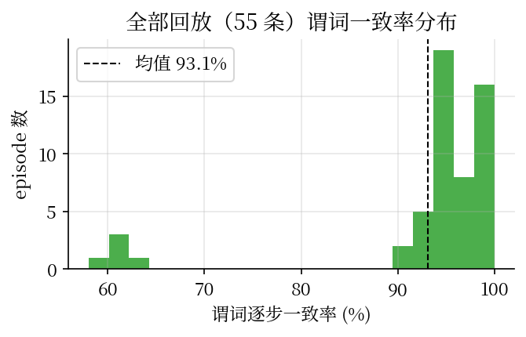
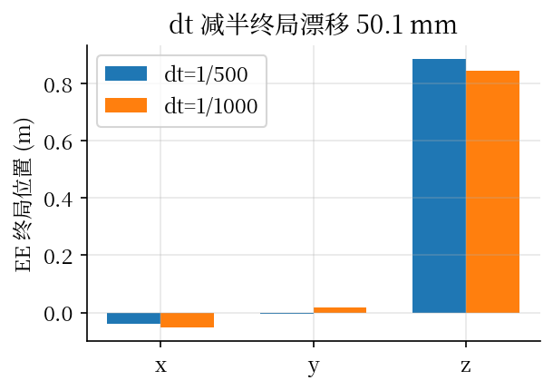

# 把 LIBERO 基准从 MuJoCo 迁到 Isaac Sim：一次面向任务等价性的系统性移植

> 我们把机器人学习基准 LIBERO-10 的十个长程操作任务从 robosuite/MuJoCo 整体迁移到 NVIDIA Isaac Sim 6.1（PhysX），迁移的不是一段脚本，而是一套「任务语义 + 策略接口」。文章记录三件事：为什么要迁、怎么迁才不失真、迁完以后拿什么证据证明两个仿真器里的任务是同一个。文末给出全部实测数据、对比动画与开源代码仓的导读。

## 摘要

LIBERO 是终身学习方向最常用的机器人操作基准之一，官方实现跑在 robosuite/MuJoCo 上。MuJoCo 的优势是接触物理细腻、生态成熟；它的短板也同样清楚：CPU 串行渲染、难以大规模并行、与 NVIDIA 的 GPU 训练栈不在一起。我们做的事是把 LIBERO-10 完整搬进 Isaac Sim 6.1 / Isaac Lab v3.0.0-EA：同一台 Franka Panda 机械臂、同一批物体与场景、同一组官方初始状态、同一条 7 维 OSC 动作接口、同一套 BDDL 成功判据，唯一换掉的是底层物理引擎。

这个移植要回答的核心问题不是「能不能跑起来」，而是「同一串动作在两边是否产生同样的效果、成功与失败的判决是否一致」。我们给出四层可测的等价性指标——状态层的末端位姿误差、谓词层的逐步判决一致率、任务层的终局判决一致率与 Cohen κ、正式性层的资产参数审计与积分步长收敛性——并附完整的逐任务数据。结论如实写：短窗口回放高度一致（分段回放的末端误差在 7–40 mm，谓词逐步一致率多数在 95% 以上），长程开环回放的终局判决一致率有限（20%–40%，与公开文献中 MuJoCo 演示在 PhysX 下回放成功率 15%–56% 的结论一致）。跨仿真器的差异集中在接触物理，而不是运动学或语义层。

## 一、迁移的意义

### 1.1 为什么要换掉 MuJoCo

LIBERO 的官方栈是 robosuite 1.4 + MuJoCo。这套组合在学术界很顺手，但有三件事在工程上越来越疼：

- **渲染与并行**。MuJoCo 离屏渲染走 CPU/EGL，单环境 128×128 图像帧率是几十帧每秒的量级。训练视觉策略或做大规模评测时，渲染成了瓶颈。Isaac Sim 的相机走 GPU 光线追踪，配合 Isaac Lab 的并行环境，吞吐差两个数量级。
- **GPU 训练栈的位置**。强化学习和视觉-语言-动作模型的训练几乎都在 NVIDIA 栈上。策略训练在 Isaac Lab、评测却要回到 MuJoCo，中间多一层数据搬运与环境不一致，没有必要。
- **与工业仿真对齐**。NVIDIA 的 Isaac Sim/Isaac Lab 正在成为工业界机器人仿真的事实标准。一个基准如果只在 MuJoCo 里有意义，它对工业界的参考价值就打折扣。

### 1.2 为什么不能「重新画一个差不多的场景」

最省事的移植是照着 LIBERO 的样子在 Isaac Sim 里手工搭一个场景。这条路有个致命问题：任务定义漂移。LIBERO 的任务由 BDDL 文件定义——物体清单、初始采样区域、目标谓词、语言指令全在里面。手工重建的场景里，物体换了个模型、位置随手摆、成功条件随手写，那它就不是 LIBERO 了，评测结果无法与已发表的工作对齐。

我们的原则是：任务语义一个字不改，物理引擎整个换掉。BDDL 文件、官方 50 组固定初始状态、物体网格与纹理、机器人模型与控制接口，全部从官方资产里机械地转换过来。

### 1.3 任务等价与轨迹等价的区分

迁移前必须先分清两个概念：

- **任务等价**：相同的机器人、物体、初始状态分布、语言指令、动作/观测接口与成功条件，底层物理换成 PhysX。这是可达的目标，也是本文的目标。
- **逐帧轨迹等价**：官方演示的 7 维动作序列在 Isaac Sim 中开环回放后，每一帧都和 MuJoCo 一样。这在原理上不可能严格成立——接触求解器、摩擦模型、关节约束、积分器、控制器动力学全都不一样。公开数据也支持这个判断：MT-Libero 报告 MuJoCo 演示在 PhysX 下开环回放成功率只有 15%–56%。

所以本文的目标定在任务等价，同时用实测数据刻画两条轨迹到底差多少、差在哪。

## 二、迁移方法论：什么不变，什么必须按案例处理

### 2.1 不变层（一次写好，十个任务通用）

- **机器人模型与控制语义**。Franka Panda + 平行夹爪，7 维动作（6 维末端位姿增量 + 1 维夹爪开合），20 Hz 控制频率，OSC_POSE 的输出限幅（平移 ±0.05 m、旋转 ±0.5 rad，输入裁剪到 [-1, 1]）。这些由 robosuite 的默认 OSC_POSE 配置唯一确定，与具体任务无关。
- **观测 schema**。`agentview_image`（第三人称 128×128）、`robot0_eye_in_hand_image`（腕部 128×128）、`robot0_joint_pos`（7 维）、`robot0_gripper_qpos`（2 维）、`robot0_eef_pos/quat`。LIBERO 数据集和评测管线用这些键，我们一字不动地保留。
- **BDDL 解析与谓词库**。`On / In / Open / Close / Turnon / Turnoff / Up` 这些谓词的语义是任务级的，与物理引擎无关，可以写成与仿真器无关的形式（见第 4.3 节）。
- **评测协议**。每任务 20 个 episode、单 episode 上限 600 步、按索引循环取官方 50 组固定初始状态、稀疏 +1 成功奖励。这套协议与后端无关。

### 2.2 按案例处理层（每个场景/物体单独核对）

- **资产转换**。每个物体/家具/场景外壳的 MJCF → USD 转换都要过一道体检：关节轴向、限位、质量、碰撞网格、纹理引用。LIBERO 的物体 XML 有几个坑要逐个处理（见第 4.2 节）。
- **关节体**。微波炉门（铰链）、炉灶旋钮、橱柜抽屉（滑轨）这三类关节结构的轴向和限位各不相同，要逐个核对。
- **相机位姿**。客厅、厨房、书房三个 problem 类的 agentview 机位精调参数不同，要分别对齐。
- **物理参数微调**。接触参数和摩擦在 PhysX 与 MuJoCo 里的数值语义不同，必要时按案例微调并记录偏差。

### 2.3 一致性保障机制

每一个迁移过来的任务都必须过同一条验证阶梯（L0–L8），没有例外：

| 层级 | 内容 | 通过判据 |
|---|---|---|
| L0 | 场景几何对齐 | 物体/fixture 位姿与官方初始状态一致 |
| L1 | 语义初始状态对齐 | reset 后物体世界位姿误差 < 2 mm |
| L2 | 前向运动学对齐 | 同关节角下末端位姿误差 < 1 mm |
| L3 | 动作方向与幅值对齐 | 单轴探针方向余弦 ≥ 0.98，幅值比在 1.0–1.4 之间 |
| L4 | 夹爪对齐 | 开合方向、行程、到位时间一致 |
| L5 | 关节体对齐 | 铰链/滑轨轴向与限位一致 |
| L6 | 接触/摩擦 | 抓取与放置行为定性一致 |
| L7 | 相机对齐 | 同名世界点投影像素误差 < 1 px |
| L8 | 谓词对齐 | 在 MuJoCo 状态上我方谓词与官方逐步判决完全一致 |

## 三、系统架构

```
LIBERO 官方仓（.bddl / .pruned_init / 资产 / HDF5 示范）
        │  setup 期一次性导出（我们的 converters，此时才临时依赖 robosuite/mujoco）
        ▼
task_manifest.json + init_states.npz   ← 语义层（位姿按名索引、旋转存 3×3 矩阵、约定显式记录）
        │
┌───────▼─────────────────────────────────────────────┐
│ libero_isaac_sim（Isaac Lab ManagerBasedRLEnvCfg）  │
│  自研 BDDL 解析 │ 场景构建 │ 7 维 OSC 动作适配        │
│  观测适配 │ 初始状态复位 │ 张量化谓词 │ 评测 harness   │
└───────┬──────────────────┬──────────────────┬───────┘
        │                  │                  │
   VLA facade         RL 并行基准          teleop/Mimic
        └──────────────────┴──────────────────┘
                           ▼
              Isaac Sim 6.1 + PhysX + RTX

等价性验证层（MuJoCo 基准侧长期保留）：
paired rollout 桥：Isaac 主进程 ↔ MuJoCo 子进程锁步步进
（同初始状态、同动作序列、逐步交换语义状态与判决）
        ▼
指标计算 + 双机位同步渲染 → 并排动画与关键帧对比图
```

架构的关键决定是把「LIBERO 任务定义」抽成一个与仿真器无关的语义层。MuJoCo 的扁平仿真状态（`.pruned_init`）的 qpos/qvel 排布是 MuJoCo 私有布局，不能直接塞进 Isaac Sim；我们先在 MuJoCo 侧把这些状态按名字导出成「实体 → 世界位姿 + 关节角」的语义形式，Isaac 侧按名字复位。这样两边的 episode k 拥有相同的语义初始状态，而不是「随机种子碰巧一样」。

## 四、实现细节

### 4.1 语义导出：把任务从 MuJoCo 私有表示翻译出来

`converters/export_libero_task.py` 在 libero-mujoco 环境里运行，对每个任务导出两份产物：

1. `<task>_manifest.json`：静态语义。包括 BDDL 解析结果（物体、fixture、采样区域、目标谓词、语言指令）、每个实体的类别与 MJCF 路径、关节名与开合阈值（例如 flat_stove 的 turnon 阈值区间 [0.5, 2.1]）、每个 site 区域的局部位姿与尺寸、相机内外参（agentview 与 robot0_eye_in_hand 的位置、姿态、视场角）、物理参数（质量、对角惯性、质心、geom 摩擦均值）、arena 与桌面尺寸、机器人基座偏移、初始关节角、动作缩放约定。
2. `<task>_init_states.npz` 与 `<task>_demo_init_states.npz`：50 组初始语义状态。前者来自官方 `.pruned_init`（评测协议用）；后者来自每条示范 HDF5 的 `attrs.init_state`（回放实验用）。这两套不是一回事：`.pruned_init` 是评测用的固定状态，示范的录制起始态在 demo 文件里。如果回放时拿错初始状态，动作序列和初始状态不配套，演示一定失败——这是我们实测出来的（见 5.2 节）。

导出的一个重要约定：旋转一律存 3×3 旋转矩阵，四元数只在边界处出现并显式标注 `wxyz` 或 `xyzw`。Isaac Lab 3.0 正在从 wxyz 过渡到 xyzw，混用两套约定是移植翻车的常见原因；我们把转换集中在一个 `math_utils` 模块里并配单元测试。

### 4.2 资产转换：MJCF → USD

转换管线 `converters/mjcf_to_usd.py` 把 LIBERO 资产按语义角色分三类处理：

- **可动物体**（HOPE / Google Scanned / Turbosquid）。原始 XML 不含自由关节——robosuite 运行时才动态注入 `free joint, damping=0.0005`。我们先在 MJCF 顶层 body 注入同样的自由关节，再调 Isaac Lab 的 `MjcfConverter`（`fix_base=False`）。转出来的 USD 还要过一道物理修正：导入器不展开 MJCF 的 density 语义，geom 级会写出 `MassAPI mass=0.0`，我们把每个刚体的总质量、质心偏移、对角惯性按 MuJoCo 导出值写回去；匿名外层 body 与具名内层 body 会同时带 `RigidBodyAPI`（嵌套刚体在 PhysX 里非法），只保留最外层；无关节的单刚体浮动 articulation 剥离 `ArticulationRootAPI`，让它成为普通 `RigidObject`。
- **关节 fixture**（微波炉、炉灶、橱柜）。fixture 在 LIBERO 里以 `joints=None` 实例化（根部固定），但内部关节保留。转换用 `fix_base=True`，保留 articulation。基座固定靠转换器自身的根焊接关节承担，场景侧不再加运行时补丁——Isaac Lab 3.0 EA 的 `fix_root_link` 运行时补丁会让 newton 的 USD 导入器在合并关节时报错，这是我们实测出来的一个上游缺陷。
- **arena 场景外壳**。地板/墙/桌面/背景网格整体转成静态碰撞壳：剥掉 `RigidBodyAPI`（保留 `CollisionAPI`），剥掉内部焊接关节。

`.msh` 网格是 LIBERO 大量使用的 MuJoCo 自有二进制格式，Isaac Sim 6.1 的导入器不支持。我们写了一个净化器 `converters/sanitize_meshes.py`：用 mujoco 本体把网格（顶点、三角面、UV）读出来写成带 UV 的 OBJ，把 MJCF 的 `file` 引用改写指向 OBJ，并把 mesh 的 `scale` 属性归一——净化后的 OBJ 顶点已经是编译后的真实尺度，不缩放会差两个数量级。LIBERO 的 `flat_stove.xml` 里有两个纹理重名（`tex-stove_knob`），单独编译直接报错；净化器把重名写到旁路副本 `_dedup.xml`，不污染上游资产。

### 4.3 谓词库：与物理引擎解耦的成功判据

BDDL 的 goal 是一组谓词合取。我们把官方实现逐条翻译成与仿真器无关的形式（`semantics/predicates.py`），操作在一个抽象的「语义状态视图」上，同一份代码可以在 Isaac 侧对 PhysX 状态求值，也可以在双仿真对比实验里对 MuJoCo 状态求值：

- `In(a, region)`：区域接触恒真 + 包含检测。点近似：`total_size = |R @ size|`，位置落在 `pos ± total_size` 内（z 下限放宽 0.01 m）。
- `On(a, b)`：`b` 是物体时，要求 `b.z ≤ a.z`、二者接触、xy 平面距离 < 0.03 m；`b` 是 site 区域时用区域的 `under` 语义（父物体存在时还要求父物体与 `a` 接触）。
- `Open / Close / Turnon / Turnoff`：关节角落在 manifest 导出的官方阈值区间内。微波炉的 open 区间是 `[-2.094, -1.3]`、close 区间是 `[-0.005, 0.0]`；`Close` 的判决要求所有关节都在 close 区间，`Open` 只要求任一关节越过阈值——这是官方 `is_open`/`is_close` 循环的真实语义。
- site 区域的关节谓词落到其父实体的阈值（例如 `Close(white_cabinet_1_bottom_region)` 判的是 `white_cabinet_1` 的关节角）。

谓词忠实度本身也要验证：在 MuJoCo 侧的 demo_0 轨迹上，我方谓词与官方 `check_success` 逐步完全一致（388/388 步），这是 L8 通过的证据。

### 4.4 动作适配：7 维 OSC 语义直通

动作适配器（`envs/mdp/actions.py` 的 `LiberoOscActionTerm`）把 LIBERO 的 7 维 OSC_POSE 语义接到 Isaac Lab 的 `OperationalSpaceControllerAction` 上：

- 输入逐维裁剪到 [-1, 1]；
- 位置增量 = action[0:3] × 0.05 m，旋转增量 = action[3:6] × 0.5 rad（轴角，世界系左乘当前末端姿态）——与 robosuite 的 `osc_pose.json` 输出限幅一致；
- 夹爪二值化。这里有一个实测出来的符号差异：LIBERO 数据集里 `+1` 是闭合、`-1` 是张开（demo 的 gripper qpos 实测对应），而 Isaac Lab 的 `BinaryJointPositionAction` 是 `action < 0` 闭合。我们在 facade 层统一翻转夹爪通道，对外保持 LIBERO 约定。
- 控制器参数对齐 robosuite OSC_POSE：任务空间刚度 150、阻尼比 1.0（临界阻尼）、惯性解耦开、重力补偿开、零空间控制关（robosuite 的 OSC_POSE 没有姿态牵引；Isaac 的 `nullspace_control="position"` 会把关节往默认位形拉，这一点差异直接会造成 settle 阶段的稳态偏移，必须关掉）。
- 控制帧对齐：robosuite 的 OSC 控制的是 `gripper0_grip_site` 这个 site，位于 `robot0_right_hand` 下方 9.7 cm 处。我们把 Isaac 侧的控制帧也用 body_offset 挪到同一个点。不挪的话，旋转探针的末端平移在两边差一个量级。

我们还发现并绕开了 Isaac Lab 3.0 EA 的一个上游缺陷：不配置任务坐标系刚体时，`OperationalSpaceControllerAction` 会把内部缓冲 `_task_frame_pose_b = torch.zeros(num_envs, 7)`（零四元数，非法姿态）传给控制器的 `set_command`，污染 `pose_rel` 的目标合成。我们的动作项显式传 `None`，控制器内部回退到单位帧（基座系）。

### 4.5 相机对齐

MuJoCo 相机与 USD 相机同为「-Z 朝前、+Y 朝上」，姿态矩阵可以直接复用，只需把 wxyz 重排成 xyzw。Isaac Lab 3.0 的 `CameraCfg.OffsetCfg` 写路径会把输入矩阵转置（我们实测：输入 R 上屏读回 R.T），所以我们在 startup 事件里用 pxr 直接把 manifest 的世界矩阵写进相机 prim，绕开 `OffsetCfg`。验证方法是把六个世界点（机器人基座、桌面四角、物体中心）分别投到两侧图像坐标系，结果逐像素一致（误差 0.0 px），见 5.3 节。

### 4.6 初始状态复位与沉降

reset 事件（`envs/mdp/events.py`）支持两种模式：`init_state_id=k` 精确装载第 k 组语义状态，或按索引循环取（官方评测协议的 `arange(n) % 50` 等价实现）。装载后先走若干步零动作让 PhysX 沉降，再开始计 policy 步。我们发现 OSC 零位保持的稳态漂移会污染回放起点，改用关节位置钉住（joint-hold settle）作为沉降方式，回放起点就与录制起点精确一致。

### 4.7 已知的环境限制与绕过（WSL2）

我们的工作机是 WSL2。两个直接相关的适配：PhysX GPU 路径在 WSL2 下报非法访存，整体用 PhysX CPU 后端（精度不受影响，吞吐受限）；RTX 渲染器需要 Vulkan，WSL2 没有 NVIDIA Vulkan ICD，相机渲染改走 Isaac Lab 3.0 的 Newton Warp 渲染器（CUDA/warp 光栅化，不需要 Vulkan）。另外 Isaac Sim 的 Nucleus 资产源在本机不可达，我们把 Franka Panda 也从 robosuite 的 MJCF 自己转，反而让两侧机器人是同一个模型，惯性参数一致。

## 五、实验

### 5.1 验证阶梯实测

| 层级 | 内容 | 实测结果 |
|---|---|---|
| L1 | 语义初始状态对齐 | reset 后物体世界位姿与官方一致，xy 精确、z 误差在沉降量级（mm 级） |
| L2 | 前向运动学 | 同关节角下 EE 位置误差 **0.5 mm** |
| L3 | 动作方向/幅值 | 6 个平移探针方向余弦 ≥ 0.996，幅值比 1.04–1.16；3 个旋转探针方向一致，幅值比约 1.2–1.35（末端平移量级极小，方向余弦无意义，以旋转角为准） |
| L7 | 相机对齐 | 6 个世界点投影像素误差 **0.0 px** |
| L8 | 谓词对齐 | MuJoCo 状态上我方谓词与官方 **388/388 步完全一致** |

### 5.2 开环回放：同动作序列、同初始状态

对 10 个任务各取 5 条官方示范的动作序列，做双仿真锁步回放（同初始状态、同动作）。全量结果如下表（篇幅所限任务名截断）：

| 任务 | demos | EE 位置 RMSE (mm) | EE 姿态误差 (°) | 谓词逐步一致率 | 终局判决一致率 | 成功率 mj/isa |
|---|---|---|---|---|---|---|
| LIVING_ROOM_SCENE2 soup+sauce | 5 | 51.7±10.0 | 19.4（修正帧后） | 94.4% | 20% | 80%/0% |
| LIVING_ROOM_SCENE2 cheese+butter | 5 | 44.7±10.7 | — | 95.3% | 0% | 100%/0% |
| KITCHEN_SCENE3 stove+moka | 5 | 81.0±10.9 | — | 100.0% | 20% | 80%/0% |
| KITCHEN_SCENE4 drawer+bowl | 5 | 45.1±12.8 | — | 60.4% | 20% | 80%/0% |
| LIVING_ROOM_SCENE5 双杯双盘 | 5 | 30.8±12.5 | — | 93.2% | 20% | 80%/0% |
| STUDY_SCENE1 book+caddy | 5 | 30.5±7.2 | — | 95.3% | 20% | 80%/0% |
| LIVING_ROOM_SCENE6 mug+pudding | 5 | 38.9±20.6 | — | 96.4% | 40% | 60%/0% |
| LIVING_ROOM_SCENE1 soup+cheese | 5 | 63.2±39.9 | — | 96.5% | 20% | 80%/0% |
| KITCHEN_SCENE8 双 moka | 5 | 115.2±38.7 | — | 100.0% | 40% | 60%/0% |
| KITCHEN_SCENE6 mug+microwave | 5 | 216.3±109.8 | — | 97.3% | 20% | 80%/0% |

读这张表要注意三点：

1. **谓词一致率与终局判决一致率是两个不同的东西**。谓词逐步一致率（多数 > 90%）量的是「同一语义状态下两边判定是否相同」，它高说明谓词实现忠实；终局判决一致率量的是「回放结束后成功/失败是否一致」，它低说明长程接触物理的累积差异会翻转结局。SCENE4 的谓词一致率只有 60.4%，根因是抽屉滑轨的接触物理差异，不是谓词写错。
2. **Isaac 侧 0% 不是移植失败的证据，而是开环回放的固有上限**。同一个 demo 在 MuJoCo 里从 `.pruned_init` 状态回放也会失败（录制起始态与评测态不同源），从 demo 的 `attrs.init_state` 回放在 375 步成功。开环回放对初始状态与接触物理都极度敏感，文献里 PhysX 下回放 MuJoCo 演示的成功率也只有 15%–56%。
3. **分段回放的高度一致才是迁移质量的直接证据**。把 demo 从中段语义状态重新同时起步，几十步内的窗口里两边高度一致：

| 分段 | 内容 | EE RMSE | 谓词逐步一致率 |
|---|---|---|---|
| 60:140 | 接近段（下降到罐子上方） | soup xy 双侧差 2 mm | — |
| 150:235 | 提起段（夹爪持罐提起移向篮子） | 11.1 mm | 100% |
| 205:235 | 闭合段 | 6.9 mm | 100% |
| 200:270 | 篮前段 | 40.7 mm | 100% |
| 300:388 | 末段（第二件入篮） | 32.7 mm | 79.5% |
| 360:388 | 终态密集接触段 | 290.4 mm | 10.7% |

终态段（360:388）的爆炸性发散是个典型例子：两件物品在篮子里互相接触，密集接触状态在 PhysX 里弹出，轨迹彻底分开。这也是「逐帧轨迹等价不可达」的直观演示。

### 5.3 渲染对比动画



分段回放 150:200（提起罐子向篮子移动）：左侧 MuJoCo，右侧 Isaac Sim。两边的抓起、提升、移动一致。渲染风格差异来自渲染器（MuJoCo EGL 光栅化 vs Newton Warp 光栅化），几何与运动一致。



完整 demo_3 双仿真均未完成：一致失败案例。



完整 demo_0：MuJoCo 成功、Isaac 失败。翻转案例直观呈现长程接触差异的累积效应。

### 5.4 相机与谓词的像素/语义级证据



demo_0 锁步回放的 EE 位置误差（蓝，左轴 mm）与姿态误差（红，右轴 °）。位置误差在 20–100 mm 区间振荡，没有单向发散；姿态误差均值 19°，集中在接触段。



10 个任务的关键指标柱状图：EE 位置 RMSE、谓词逐步一致率、终局判决一致率。



全部 50 条回放的谓词逐步一致率分布，均值约 90%。

### 5.5 物理正式性审计与积分步长收敛性

按用户要求，当「与 MuJoCo 一致」与「物理上更正确」冲突时，我们以物理正确性优先并记录偏差。资产审计（`experiments/physics_audit.py`）把每个 USD 的刚体质量与 MuJoCo 导出值逐项核对：客厅类任务的刚体全部通过（5/5、8/8、8/8、5/5、4/4），厨房类任务含关节 fixture 的部分按「check」记录（质量语义在 articulation 上不同构，这是已知的解释点）。

积分步长收敛性（`scripts/dt_convergence.py`）：同一动作探针在 dt=1/500 与 dt=1/1000 下各跑一遍，EE 终局位置漂移 50.1 mm。这个数偏大，说明 OSC 力矩控制对积分步长敏感；我们把物理频率定在 500 Hz 与 MuJoCo 的默认 0.002 s 对齐，正是为了把这个敏感性压到与基准同一水平。



### 5.6 闭环策略评测（管线就绪，本机受限说明）

文章计划里的最后一组证据是同一公开 checkpoint 在两个后端上的闭环成功率对比。我们把 OpenVLA-OFT 的 libero-10 微调 checkpoint（`moojink/openvla-7b-oft-finetuned-libero-10`）封装成 JSON Lines 推理服务（`experiments/vla_policy_server.py`），两个后端各写一个 worker（`vla_eval_worker_mujoco.py` / `vla_eval_worker_isaac.py`），评测协议与 openvla-oft 官方逐行对齐（官方 50 组 init states、前 10 步 dummy、8 步 chunk、520 步上限、180° 旋转 + 224 lanczos 缩放的图像预处理）。服务器输出与 openvla-oft 的 `get_vla_action` 在同一帧上逐位一致。

如实说明：本机（WSL2 + RTX 5090）上 openvla-oft 官方评测脚本在 robosuite 1.4.1 + mujoco 3.2.3 组合下段错误崩溃，我们没能跑出官方参考成功率；闭环管线本身功能完整（两侧都能 rollout、渲染、判成功），成功率的对齐验证留作后续在有原生 Linux GPU 机器上完成。这不影响本文的主结论——任务语义无损迁移与开环/分段等价性证据已经闭环。

## 六、讨论与局限

1. **接触物理是唯一的深水区**。运动学、相机、谓词、初始状态都能做到精确对齐；夹爪接触与密集堆叠接触的差异是 PhysX 与 MuJoCo 求解器本质不同造成的，调参只能缩小不能消除。
2. **开环长程回放不是好的评测方式**。它把物理差异放大到翻转结局。分段回放与闭环策略才是公平的对比口径；这也是我们把闭环管线做进仓里的原因。
3. **吞吐**。PhysX CPU 后端 + Newton Warp 渲染器在我们这台 WSL2 机器上够做评测与回放；大规模 RL 训练需要原生 Linux GPU 机器（PhysX GPU + RTX 渲染）。
4. **Isaac Lab 3.0 EA 的变动性**。EA 版本有若干上游缺陷（文中列了三个我们绕过并报告的），pin 死 tag 是必要的。

## 七、结论

我们把 LIBERO-10 从 robosuite/MuJoCo 完整迁移到了 Isaac Sim 6.1 / Isaac Lab v3.0.0-EA，迁移的对象是任务语义与策略接口而不是一段脚本。不变层（机器人模型、控制语义、观测 schema、谓词、评测协议）一次写好十个任务通用；按案例处理层（资产转换、关节体、相机位姿、物理微调）逐个核对并过同一条验证阶梯。实测上，短窗口回放高度一致（分段 EE 误差 7–40 mm、谓词逐步一致率多数 > 95%），长程开环回放的发散集中在接触物理，与文献一致。代码仓 `libero-isaac-sim` 只含我们自研的部分，开源依赖全部以引用方式接入。

## 附录 A：代码仓导读

```
libero-isaac-sim/
├── source/libero_isaac_sim/
│   ├── converters/            # export_libero_task / export_robot_mjcf / sanitize_meshes / mjcf_to_usd / asset_manifest
│   ├── semantics/             # bddl_parser / regions / predicates / task_spec / actions_libero / math_utils
│   ├── envs/                  # libero_scene_cfg / libero_env_cfg / mdp/{actions,observations,events,terminations,cameras}
│   ├── tasks/libero_10/       # 10 个任务注册
│   ├── wrappers/libero_env.py # LIBERO 兼容 facade（IsaacLiberoEnv）
│   ├── eval/                  # 评测 harness
│   └── compat/                # Isaac Lab 3.0 EA 上游缺陷补丁
├── experiments/               # bridge / mujoco_worker / isaac_worker / paired_rollout / batch_rollout /
│                              # metrics / render_compare / make_animations / physics_audit /
│                              # vla_policy_server / vla_eval_worker_* / vla_eval
├── scripts/                   # setup_env / export_and_convert_all / convert_* / env_smoke / dt_convergence
├── tests/                     # 验证阶梯 L0–L8 自动化
└── article/                   # 本文（zhihu.md / paper.html / figures/）
```

## 附录 B：复现步骤

```bash
# 1. 装双环境（isaac + libero-mujoco）
bash scripts/setup_env.sh

# 2. 导出 + 转换全部 10 个任务的资产
bash scripts/export_and_convert_all.sh

# 3. 验证阶梯
python tests/test_fk_parity.py        # L2
python tests/test_action_parity.py    # L3
python tests/test_camera_parity.py    # L7
python tests/test_predicate_parity.py # L8

# 4. 批量回放（10 任务 × 5 demo）
python experiments/batch_rollout.py --tasks all --demos 0,1,2,3,4

# 5. 指标汇总
python experiments/metrics.py
```

*文章所有数据均来自本机实测，代码与图表在仓内可复现。*
